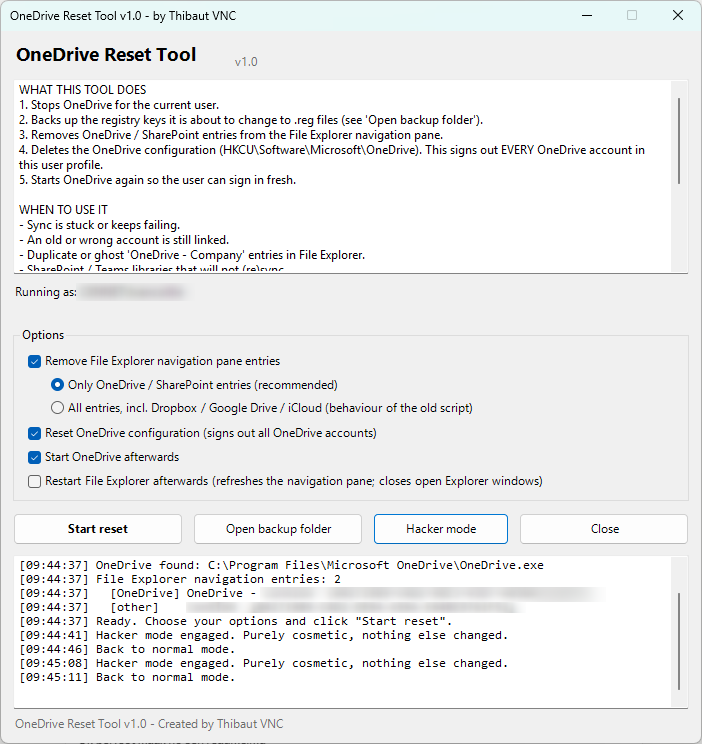
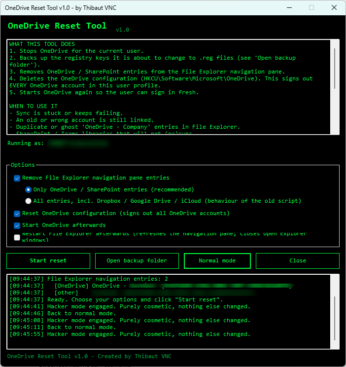

# OneDrive Reset Tool

A single `.bat` file that signs the current user out of OneDrive, cleans up ghost
OneDrive / SharePoint entries in the File Explorer navigation pane, and backs up
every registry key it touches before it removes anything.

No installation, no dependencies, no PowerShell script file to unblock: the batch
file launches the PowerShell GUI that is stored inside itself.



---

## What it does

1. Stops OneDrive for the current user (current session only).
2. Exports the registry keys it is about to change to `.reg` files.
3. Removes OneDrive / SharePoint entries from the File Explorer navigation pane.
4. Deletes `HKCU\Software\Microsoft\OneDrive`, which signs out every OneDrive
   account in this user profile.
5. Starts OneDrive again so the user can sign in fresh.

## When to use it

- Sync is stuck or keeps failing.
- An old or wrong account is still linked.
- Duplicate or ghost `OneDrive - Company` entries in File Explorer.
- SharePoint / Teams libraries that will not (re)sync.

## Hacker mode

There is a button called **Hacker mode**. It paints the whole window black,
turns the text bright green and switches everything to Consolas.



This is the single most important feature of the tool. Some facts you should be
aware of before you use it:

- Press it right before the user looks over your shoulder. The exact same click
  on "Start reset" now reads as *deep system surgery* instead of *IT guy fixing
  OneDrive again*.
- Colleagues will ask which terminal you are in. The correct answer is a slow nod.
- Nothing is faster in hacker mode. It only *looks* faster, which is 90% of the job.
- The GUID list in the log was already unreadable. In green it becomes
  intimidating, which is a measurable upgrade.
- You can toggle back and forth as often as you like. Toggling it three times in
  a row during a reset looks like you are trying different exploits.
- Legal disclaimer: pressing this button does not make you a hacker. It makes
  you an IT guy with excellent taste.

The switch is purely cosmetic. Colours only, no behaviour changes, and it can be
toggled at any moment, including after a reset has already run.

## No-GUI edition

`OneDrive_Reset_NoGUI.bat` does exactly the same thing in a console window: no
form, no hacker mode, just output on screen. Handy for remote sessions, RMM
deployment or a login script.

- Options are five `1` / `0` variables at the top of the file.
- Run it with `/Y` to skip the confirmation prompt and the `pause` at the end.
- It writes the same backups and `log.txt` as the GUI version.

## Requirements

- Windows 10 or 11 (also fine on Windows Server / RDS).
- Windows PowerShell 5.1, which ships with Windows. Nothing extra to install.
- No administrator rights needed: only `HKEY_CURRENT_USER` is changed.

## How to use it

1. Copy `OneDrive_Reset_Tool.bat` to the machine (or run it from a share).
2. Double-click it **as the affected user**. Do not use "Run as administrator"
   with a different admin account: that would reset the admin's profile instead
   of the user's.
3. Save and close open Office documents.
4. Check the options, click **Start reset**, confirm.
5. Sign in to OneDrive again and re-sync the SharePoint / Teams libraries.

On first launch the log already shows which `OneDrive.exe` was found and which
navigation pane entries exist, tagged `[OneDrive]` or `[other]`, so you can see
what is there before you change anything.

## Options

| Option | Default | What it does |
| --- | --- | --- |
| Remove File Explorer navigation pane entries | on | Cleans up the left-hand pane in Explorer |
| &nbsp;&nbsp;Only OneDrive / SharePoint entries | on | Leaves Dropbox, Google Drive, iCloud alone |
| &nbsp;&nbsp;All entries | off | Behaviour of the old script: wipes the whole `NameSpace` key |
| Reset OneDrive configuration | on | Signs out every OneDrive account in this profile |
| Start OneDrive afterwards | on | Relaunches OneDrive so the sign-in wizard appears |
| Restart File Explorer afterwards | off | Refreshes the navigation pane immediately; closes open Explorer windows |

## Backups and undo

Every run creates a timestamped folder:

```
%LOCALAPPDATA%\OneDriveResetTool\Backups\yyyyMMdd-HHmmss\
    Explorer-NameSpace.reg
    OneDrive-Config.reg
    log.txt
```

Use the **Open backup folder** button to get there. To undo a reset: close
OneDrive and double-click the `.reg` files.

If a backup fails, the tool aborts before deleting anything.

## What it changes exactly

| Item | Action |
| --- | --- |
| `HKCU\Software\Microsoft\Windows\CurrentVersion\Explorer\Desktop\NameSpace` | Exported, then matching subkeys removed |
| `HKCU\Software\Microsoft\OneDrive` | Exported, then removed |
| `OneDrive.exe` | Stopped, then started again (current session only) |
| `explorer.exe` | Only restarted if you tick that option |

## What it does NOT do

- It never deletes local files. The OneDrive folder on disk stays untouched.
- It does not uninstall or reinstall OneDrive.
- It does not touch `HKEY_LOCAL_MACHINE` or other user profiles.
- It does not clear the `%LOCALAPPDATA%\Microsoft\OneDrive\settings` folder.
  After signing in, OneDrive may ask whether to use the existing folder. Say yes,
  otherwise you end up with a duplicate `OneDrive - Company (2)` folder.

## Notes for technicians

- On terminal servers only processes in your own session are stopped, so other
  users keep syncing.
- The OneDrive path is read from the registry *before* the configuration is
  deleted, with a fallback to the three standard install locations
  (`%LOCALAPPDATA%`, `Program Files`, `Program Files (x86)`).
- Name, version and author live in three variables at the top of the script
  (`$AppName`, `$AppVersion`, `$AppAuthor`).
- To start in hacker mode by default, set `$script:HackerMode = $true` at the top
  and call `Set-Theme -Hacker $true` when the form is shown.

## Known quirks

- In hacker mode Consolas is wider than Segoe UI, so the longest checkbox label
  wraps and is slightly clipped. Cosmetic only.
- Some antivirus and EDR products flag a batch file that launches PowerShell and
  edits the registry. Whitelist it or run it from a trusted location.

## Files

| File | What it is |
| --- | --- |
| `OneDrive_Reset_Tool.bat` | GUI version (batch launcher + embedded PowerShell) |
| `OneDrive_Reset_NoGUI.bat` | Plain console version, same actions |
| `screenshots/` | The images used in this README |

## Credits

OneDrive Reset Tool v1.0 - Created by Thibaut VNC
